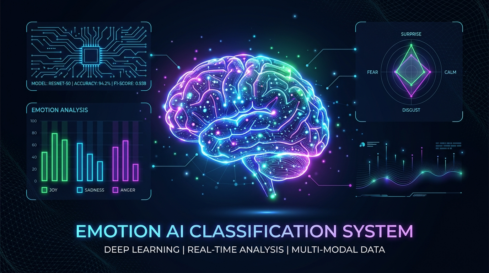

<div align="center">
  <h1>🧠 Emotion AI: Advanced Text Classification Dashboard</h1>
  <p>A comprehensive Natural Language Processing (NLP) pipeline and interactive dashboard for classifying text into human emotions.</p>
  
  
  
  <p align="center">
    
    
    
    
  </p>
</div>

---

## 📌 Overview
This project is an end-to-end Deep Learning and NLP system that classifies natural language text into **6 core Ekman emotions** (Joy, Anger, Sadness, Fear, Surprise, Disgust) plus a **Neutral** class. It serves as a personal showcase of building, training, evaluating, and deploying both traditional Recurrent Neural Networks (RNNs) and modern Transformer architectures from scratch.

## 📊 Dataset Details
The models were trained on the [Google Research GoEmotions dataset](https://github.com/google-research/google-research/tree/master/goemotions), which originally contains 27 fine-grained emotion categories.
- **Mapping Strategy:** We reduced the 27 classes down to the 6 primary Ekman emotions (plus neutral) to ensure a more robust and distinct classification boundary.
- **Imbalance Handling:** The dataset is heavily imbalanced (e.g., Neutral and Joy dominate, while Disgust and Fear are minority classes). We calculated and applied **Balanced Class Weights** during the PyTorch training loop to penalize the model heavily for missing minority classes.

## 🚀 Supported Models & Architecture
The system includes **5 different architectures** trained and evaluated on the same dataset for comparative analysis:

1. **RoBERTa (base):** State-of-the-art Transformer (125M parameters). Utilizes dynamic padding and the Hugging Face Trainer API.
2. **DistilBERT:** A distilled, lighter, and faster version of BERT (66M parameters). Excellent balance between speed and accuracy.
3. **BiLSTM + Attention:** A custom-built Bidirectional Long Short-Term Memory network integrated with a self-attention mechanism (6M parameters).
4. **LSTM:** Standard Sequence Model with GloVe Word Embeddings (5M parameters).
5. **GRU:** Gated Recurrent Unit network, computationally cheaper than LSTM (4M parameters).

## 📈 Model Performance
*Performance metrics were captured during the evaluation phase on a held-out validation set.*

| Model | Macro F1-Score | Accuracy | Inference Time / Batch | Model Size |
|---|---|---|---|---|
| **RoBERTa** | ~59% | ~63% | ~168 ms | 476 MB |
| **DistilBERT** | ~57% | ~60% | ~71 ms | 255 MB |
| **BiLSTM + Attention**| ~54% | ~59% | ~23 ms | 22 MB |
| **LSTM** | ~53% | ~61% | ~36 ms | 20 MB |
| **GRU** | ~51% | ~61% | ~22 ms | 17 MB |

*Note: The system features an interactive **Evaluation Dashboard** built into the Streamlit app with Plotly Radar charts, Bubble charts for efficiency, and Learning Curves (Epoch vs Loss/F1) showcasing the Early Stopping triggers.*

## 💻 Live AI Inference Examples
The Streamlit dashboard allows real-time inference. Here are some examples of what the models predict:

> **Input:** *"I am completely outraged by the terrible customer service I received today!"*  
> **Prediction:** 😡 **Anger** (98% Confidence - RoBERTa)

> **Input:** *"I am absolutely thrilled to announce that I finally got the promotion!"*  
> **Prediction:** 😊 **Joy** (99% Confidence - DistilBERT)

> **Input:** *"Walking alone in that dark, abandoned alley sent shivers down my spine."*  
> **Prediction:** 😨 **Fear** (85% Confidence - BiLSTM Attention)

> **Input:** *"What a shocking plot twist! I never saw that ending coming at all."*  
> **Prediction:** 😲 **Surprise** (92% Confidence - GRU)

### Simultaneous Consensus Mode
The app features a **"Compare Models"** page where a single text input is fed into all 5 loaded models simultaneously in memory, displaying a visual breakdown of the inference speed vs. confidence, and declaring the "Majority Consensus" emotion.

## 📂 Repository Structure

```text
Emotion-Classification-System/
├── app.py                  # Main Streamlit Application (Router)
├── src/                    # Source Code
│   ├── pages/              # Streamlit Pages (predict.py, compare.py, evaluation.py, about.py)
│   ├── components/         # Reusable UI Components (cards, charts, ranking, sidebar)
│   └── utils/              # Utilities (CSS styling, Model Manager for zero-latency caching)
├── notebooks/              # Jupyter/Kaggle Notebooks for EDA, Training, and Evaluation
├── models/                 # Pre-trained Weights, Vocabularies, and metrics.json (Git-ignored)
├── assets/                 # Images for README and UI
└── requirements.txt        # Python Dependencies
```

## ⚙️ How to Run Locally

1. **Clone the repository:**
```bash
git clone https://github.com/Mostafa-Abdallah/Emotion-Classification-System.git
cd Emotion-Classification-System
```

2. **Install dependencies:**
```bash
pip install -r requirements.txt
```

3. **Generate Pre-trained Models:**
   *Due to GitHub's file size limits, the trained weights are too large to be hosted here.*
   - Open the official Kaggle Notebook: **[Emotion Classification with Attention](https://www.kaggle.com/code/mostafa201714/emotion-classification-with-attention)**
   - Run all cells to train the models.
   - Download the generated output files (the `.pt` files, transformer folders, and `metrics.json`) into your local `models/` directory.

4. **Launch the Dashboard:**
```bash
streamlit run app.py
```
*The app will automatically open in your default browser at `http://localhost:8501`. Note: The first run takes ~5-10 seconds to load all models into memory.*

## 📜 License
This project is licensed under the MIT License - see the [LICENSE](LICENSE) file for details.

---
**Developed by Mostafa Abdallah**
